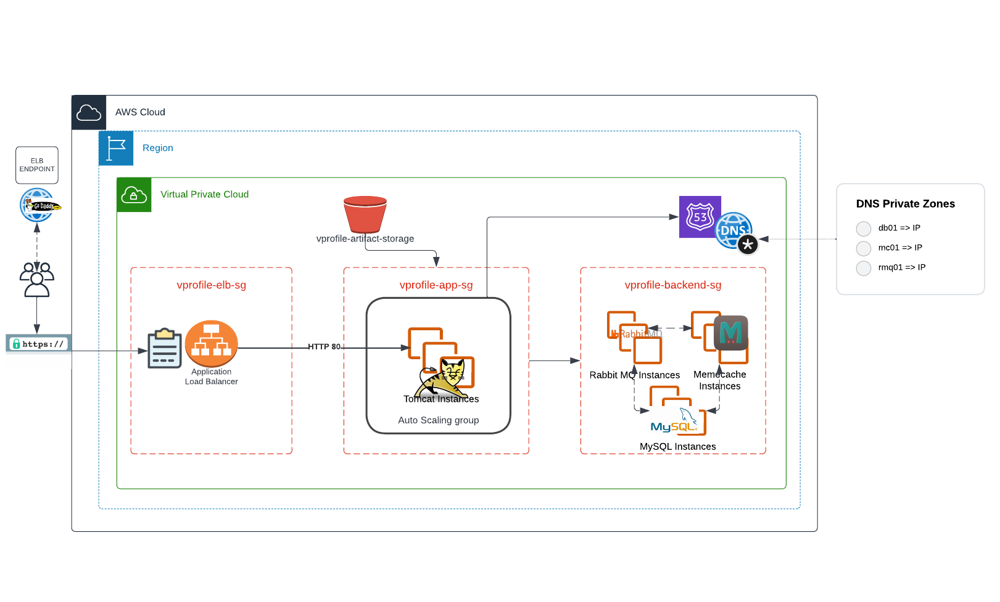
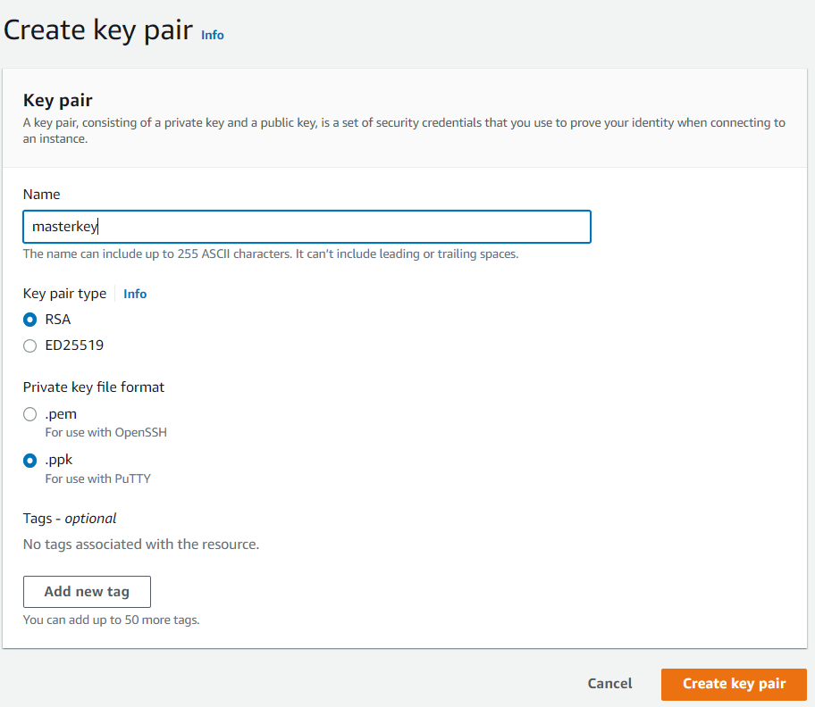

<a name="readme-top"></a>

<!-- [![Contributors][contributors-shield]][contributors-url]
[![Forks][forks-shield]][forks-url]
[![Stargazers][stars-shield]][stars-url]
[![Issues][issues-shield]][issues-url]
[![MIT License][license-shield]][license-url]
[![LinkedIn][linkedin-shield]][linkedin-url] -->

<!-- PROJECT LOGO -->
<br />
<div align="center">
  <a href="">
    
  </a>

  <h3 align="center">DevOps Project 3</h3>

  <p align="center">
    Lift and Shift Application Workload to AWS - AWS Project
  </p>
</div>

## About The Project

<p align="left">
  
</p>

A multi tier web application stack setup on a Laptop/Desktop, then using a lift and shift strategy to move the workload to Amazon Web Service (AWS).

### Built With

<!-- - [![Vagrant][vagrant]][vagrant]
- [![VirtualBox][virtualbox]][virtualbox]
- [![Tomcat][tomcat]][tomcat]
- [![RabbitMQ][rabbitmq]][rabbitmq]
- [![Memcache][memcache]][memcache]
- [![Nginx][nginx]][nginx]
- [![MySQL][mysql]][mysql]
- [![Bash][bash_script]][bash_script] -->

- EC2 Instances - VM for tomcat, rabbitmq, memcache, and mysql.
- Elastic Loadbalancer - Nginx LB Replacement.
- Autoscaling - Automation for VM scaling.
- S3/EFS - Shared storage
- Route 53 - Private DNS Service

<p align="right">(<a href="#readme-top">back to top</a>)</p>

<!-- GETTING STARTED -->

## Getting Started

### Prerequisites

<ul style="text-decoration: none;">
  <li>
    <p> AWS Account </p>
  </li>
  <li>
    <p> AWS CLI </p>
  </li>
    <li>
    <p> JDK8 </p>
  </li>
    <li>
    <p> Domain Name </p>
  </li>
    <li>
    <p> Maven </p>
  </li>
</ul>

#### 🧾 Steps

#### 1 - Provision AWS Resources

- Login to your AWS Account
- Configure AWS Certificate Manager for your domain
- Configure the certificate on your domain (I am using Godaddy)
- Create security groups

  Create vprofile-ELB-SG. Configure Inbound rules to Allow both HTTP and HTTPS on port 80 and 443 respectively from Anywhere IPv4 and IPv6.
  

  Next we will create vprofile-app-SG. Open port 8080 to accept connections from vprofile-ELb-SG.
  

  Finally, we will create vprofile-backend-SG. Open port 3306 for MySQL, 11211 for Memcached and 5672 for RabbitMQ server. We also need to open commucation AllTraffic within the vprofile-backend-SG to allow backend services to communicate with each other.
  

- Create AWS Key Pair

  

#### 2 - Launch EC2 Instances

i. Launch MySQL Instance with the details below. Open up port 22 on the vprofile-backend-SG to be able to connect to your instance for validation.

- Name: vprofile-db01
- Tag: Key - project, Value - vprofile
- Os Image: Centos 7
- Instance type: t2micro
- Key pair: vprofile-key-pair
- Security Group: vprofile-backend-SG
- UserData: userdata/mysql.sh

You can check the status of mariadb once instance is ready.

```
ssh -i vprofile-prod-key.pem centos@<public_ip_of_instance>
sudo su -
curl http://169.254.169.254/latest/user-data
systemctl status mariadb
```

ii. Launch Memcached Instance with these details

- Name: vprofile-mc01
- Tag: Key - project, Value - vprofile
- Os Image: Centos 7
- Instance type: t2micro
- Key pair: vprofile-key-pair
- Security Group: vprofile-backend-SG
- UserData: userdata/memcached.sh

You can check the status of memcache once instance is ready.

```
ssh -i vprofile-prod-key.pem centos@<public_ip_of_instance>
sudo su -
curl http://169.254.169.254/latest/user-data
systemctl status memcached.service
ss -tunpl | grep 11211
```

iii. Launch RabbitMQ Instance with these details

- Name: vprofile-rmq01
- Tag: Key - project, Value - vprofile
- Os Image: Centos 7
- Instance type: t2micro
- Key pair: vprofile-key-pair
- Security Group: vprofile-backend-SG
- UserData: userdata/rabbit.sh

You can check the status of rabbitq once instance is ready.

```
ssh -i vprofile-prod-key.pem centos@<public_ip_of_instance>
sudo su -
curl http://169.254.169.254/latest/user-data
systemctl status rabbitmq-server
```

iv. Launch Tomcat Instance with these details

- Name: vprofile-app01
- Tag: Key - project, Value - vprofile
- Os Image: Ubuntu 18.04
- Instance type: t2micro
- Key pair: vprofile-key-pair
- Security Group: vprofile-app-sg
- UserData: tomcat_ubuntu.sh

#### 3 - Configure backend IP in Route53

- Create hosted zone

  Our backend stack is running. Next we will update Private IP of our backend services in Route53 Private DNS Zone.Lets note down Private IP addresses.

  ```
  rmq01 172.31.80.20
  db01 172.31.22.178
  mc01 172.31.87.132
  ```

- Create vprofile.in Private Hosted zone in Route53. we will pick Default VPC in N.Virginia region.
  

- Create records for our backend services. We will use these record names in our application.properties file. Even if IP address of the services changes, our application won't need to change the config file.
  

#### 4 - Build application artifact locally with Maven

```
git clone https://github.com/mrvincentoti/vprofile-project.git
```

Before we create our artifact, we need to do changes to our application.properties file under `/src/main/resources` directory for below lines.

```
jdbc.url=jdbc:mysql://db01.vprofile.in:3306/accounts?useUnicode=true&

memcached.active.host=mc01.vprofile.in

rabbitmq.address=rmq01.vprofile.in
```

Go to vprofile-project root directory to the same level pom.xml exists and run below command to build application artifact (vprofile-v2.war)

```
mv install
```

#### 5 - Create an s3 bucket and Copy the generated artifact to the s3 bucket.

- We will upload our artifact to s3 bucket from AWS CLI and our Tomcat server will get the same artifact from s3 bucket.

- We will create an IAM user to allow us use AWS CLI to access resources.

```
name: vprofile-s3-admin
Access key - Programmatic access
Policy: s3FullAccess
```


- Configure AWS CLI

```
aws configure
AccessKeyID:
SecretAccessKey:
region: us-east-1
format: json
```

Create bucket. Note: S3 buckets are global so the naming must be UNIQUE!

```
aws s3 mb s3://vprofile-artifact-storage-30122022
```

- Go to target directory and copy the artifact to bucket with below command. Then verify by listing objects in the bucket.

```
aws s3 cp target/vprofile-v2.war s3://vprofile-artifact-storage-30122022
aws s3 ls s3://vprofile-artifact-storage-30122022
```

#### 6 - Download artifact from s3

Before we can download artifact from s3 in our instance we need to create an IAM Role and attach it to our application server app01

```
Type: EC2
Name: vprofile-artifact-storage-role
Policy: s3FullAccess
```

Before we login to our server, we need to open port 22 on our vprofile-app-SG

- connect to the tomcat server

```
ssh -i "vprofile-prod-key.pem" ubuntu@<public_ip_of_server>
sudo su -
systemctl status tomcat8
```

- We will delete ROOT (where default tomcat app files are stored) directory under /var/lib/tomcat8/webapps/.

```
cd /var/lib/tomcat8/webapps/
systemctl stop tomcat8
rm -rf ROOT
```

- Next we will download our artifact from s3 using aws cli commands. We will need to install aws cli.

```
apt install awscli -y
aws s3 cp s3://vprofile-artifact-storage-30122022/vprofile-v2.war /tmp/vprofile-v2.war
cp /tmp/vprofile-v2.war /var/lib/tomcat8/webapps/ROOT.war
systemctl start tomcat8
```

#### 7 - Setup LoadBalancer

- Create target group

```
Intances
Target Grp Name: vprofile-elb-TG
protocol-port: HTTP:8080
healtcheck path : /login

Advanced health check settings
Override: 8080
Healthy threshold: 3
available instance: app01 (Include as pending below)
```

- Create LoadBalancer

```
vprofile-prod-elb
Internet Facing
Select all AZs
SecGrp: vprofile-elb-secGrp
Listeners: HTTP, HTTPS
Select the certificate for HTTPS
```

- Create CNAME record on your hosting provider for LoadBalance

```
Name: vprofileapp
Value: your_elb_arn
```

- Lets check our application using our DNS. We can securely connect to our application!
  

#### 11 - Configure AutoScaling Group for Application Instances

- We will create an AMI from our App Instance.
  

- Next we will create a Launch template using the AMI created in above step for our ASG

```
Name: vprofile-app-LT
AMI: vprofile-app-image
InstanceType: t2.micro
IAM Profile: vprofile-artifact-storage-role
SecGrp: vprofile-app-SG
KeyPair: vprofile-prod-key
```

- Our Launch template is ready, now we can create our ASG.

```
Name: vprofile-app-ASG
ELB healthcheck
Add ELB
Min:1
Desired:2
Max:4
Target Tracking-CPU Utilization 50
```

- If we terminate any instances we will see ASG will create a new one using LT that we created.
  

#### 11 - Clean Up

- Delete all resources
<!-- ACKNOWLEDGMENTS -->

## Acknowledgments

Use this space to list resources you find helpful and would like to give credit to. I've included a few of my favorites to kick things off!

- [Choose an Open Source License](https://choosealicense.com)
- [GitHub Emoji Cheat Sheet](https://www.webpagefx.com/tools/emoji-cheat-sheet)
- [Img Shields](https://shields.io)
- [Rumeysa Dogan](https://github.com/rumeysakdogan)
- [Imran](https://github.com/devopshydclub)

<p align="right">(<a href="#readme-top">back to top</a>)</p>
