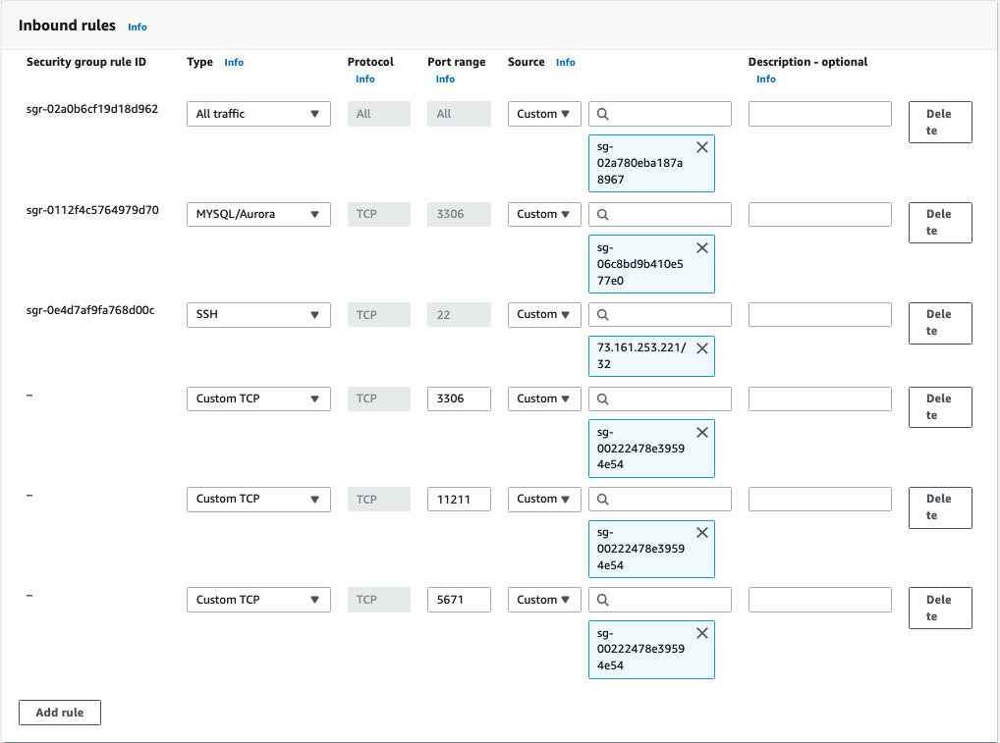
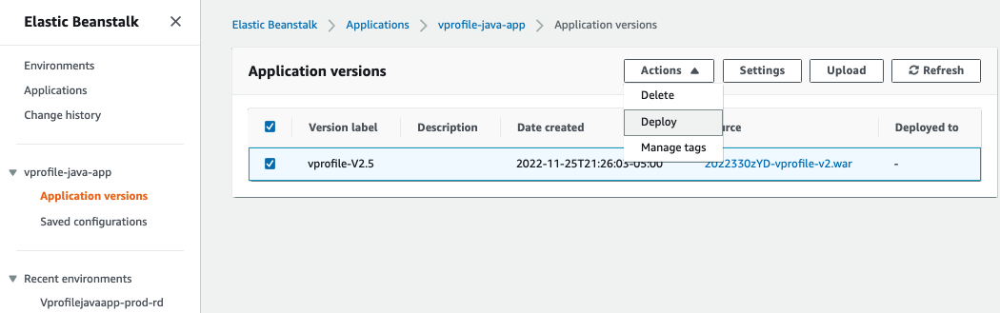
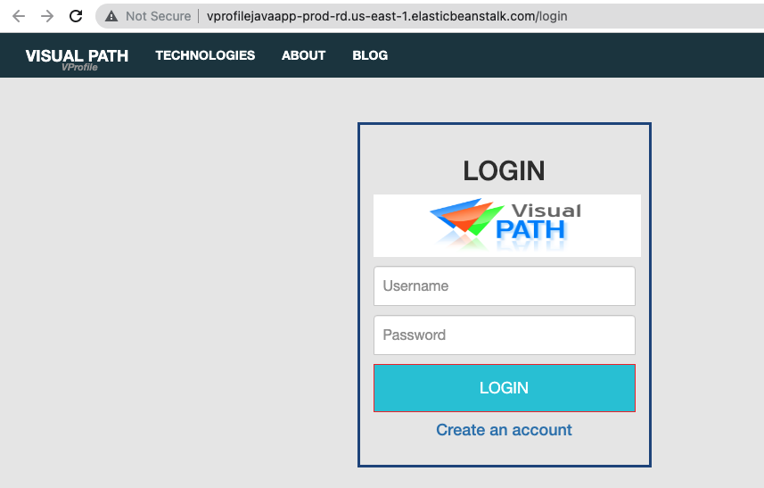

<a name="readme-top"></a>

<!-- [![Contributors][contributors-shield]][contributors-url]
[![Forks][forks-shield]][forks-url]
[![Stargazers][stars-shield]][stars-url]
[![Issues][issues-shield]][issues-url]
[![MIT License][license-shield]][license-url]
[![LinkedIn][linkedin-shield]][linkedin-url] -->

<!-- PROJECT LOGO -->
<br />
<div align="center">
  <a href="">
    
  </a>

  <h3 align="center">DevOps Project 4</h3>

  <p align="center">
    Re-Architeching Web App On AWS Cloud [Cloud Native]
  </p>
</div>

<p align="left">
  
</p>

### Built With

- Elastic Beanstalk container
- Route 53 - Public Registered DNS
- AWS CloudFront
- AWS RDS (MySQL)
- AmazonMQ
- ElastiCache

<!-- GETTING STARTED -->

## Getting Started

### Prerequisites

<ul style="text-decoration: none;">
  <li>
    <p> AWS Account </p>
  </li>
    <li>
    <p> JDK8 </p>
  </li>
    <li>
    <p> Domain Name </p>
  </li>
    <li>
    <p> Maven </p>
  </li>
</ul>

#### 🧾 Steps

#### 0 - Login to your AWS account

#### 1 - Create key pair

Create key pair that will be used with elastic beanstalk.
From the EC2 dashboard on the left menu click `Key Pairs` then `Create key pair`

```
Name: vprofile-bean-key
```

**Note: Download the Key Pair to your local machine**

#### 2 - Create security group for RDS, ActiveMQ, and ElastiCache

Create a security group that accepts all traffic (dummy, this will be updated to allow only private traffic)

```
Name:  `vprofile-backend-SG`
Inbound Rule:  `allow all traffic`
```

#### 3 - Create RDS

Create a subnet group for RDS

- Create Subnet Groups with below details

```
    Name: vprofile-rds-sub-grp
    AZ: Select All
    Subnet: Select All
```

Create Parameter Group

- When create RDS instances AWS provides the default username, password, etc. to your instance.
  with parameter group you can set custom configuration for your instance.

  ```
  Parameter group family: mysql5.7
  Type: DB Parameter Group
  Group Name: vprofile-rds-para-grp
  ```

Create RDS with these details

```
Method: Standard Create
Engine Options: MySQL
Engine version: 5.7.33
Templates: Free-Tier
DB Instance Identifier: vprofile-rds-mysql
Master username: admin
Password: Auto generate psw
Instance Type: db.t2.micro
Subnet grp: vprofile-rds-sub-grp
SecGrp:  vprofile-backend-SG
No public access
DB Authentication: Password authentication
Additional Configuration
Initial DB Name: accounts
Keep the rest default or you may add as your own preference
```

**On clicking Create button, you will see a popup. Click View credential details and take note ofauto-generated db password. It will be used in our application config files.**

#### 4 - Create Elastic Cache

Create Parameter Group

- We will create a parameter group to be used with our ElastiCache instance. If we want to use default parameter group we don't need to create one. With parameter group, we are able make updates to default parameters for our ElasticCache instance.

```
Name: vprofile-memcached-para-grp
Description: vprofile-memcached-para-grp
Family: memcached1.4
```

Create Subnet Group

- First we will create Subnet Groups with below properties:

```
Name: vprofile-memcached-sub-grp
AZ: Select All
Subnet: Select All
```

Create Memcached Cluster

- Go to `Get Started` -> `Create Clusters` -> `Memcached Clusters`

```
Location: AWS Cloud
Name: vprofile-elasticache-svc
Engine version: 1.4.5
Parameter Grp: vprofile-memcached-para-grp
NodeType: cache.t2.micro
# of Nodes: 1
SecGrp: vprofile-backend-SG
```

#### 5 - Create ActiveMQ

- We will create Amazon MQ service with below properties:

```
Engine type: RabbitMQ
Single-instance-broker
Broker name: vprofile-rmq
Instance type: mq.t3.micro
username: rabbit
psw: jsabcbfdxjkri
Additional Settings:
private Access
VPC: use default
SEcGrp: vprofile-backend-SG
```

- Do not forget to note down tour username/pwd. You won't be able to see your Password again from console.

#### 6 - Initialize DB

- Get the RDS instance endpoint
- Create an EC2 instance to initialize the DB. Please remember to terminate this instance after initialization.

```
Name: mysql-client
OS: ubuntu 18.04
t2.micro
SecGrp: Allow SSH on port 22
Keypair: vprofile-prod-key
Userdata:
#! /bin/bash
apt update -y
apt upgrade -y
apt install mysql-client -y
```

- SSH into mysl-client instance
- Update vprofile-backend-SG Inbound rule to allow connection on port 3306 for mysql-client-SG After updating rule, try to connect with below command:

```
mysql -h vprofile-rds-mysql.c4pxplx9zo2v.us-east-1.rds.amazonaws.com -u admin -p jsabcbfdxjkri
mysql> show databases;
```

- Clone our source code here to use script to initialize our database

```
git clone https://github.com/rumeysakdogan/vprofileproject-all.git
cd vprofileproject-all
git checkout aws-Refactor
cd src/main/resources
mysql -h vprofile-rds-mysql.c4pxplx9zo2v.us-east-1.rds.amazonaws.com -u admin -p accounts < db_backup.sql
mysql -h vprofile-rds-mysql.c4pxplx9zo2v.us-east-1.rds.amazonaws.com -u admin -p accounts
show tables;
```

#### 7 - Create Elastic Beanstalk Environment

- Copy backend endpoint from AWS console. We will use these information in our `application.profile` file

```
RDS Endpoint
`vprofile-rds-mysql.c4pxplx9zo2v.us-east-1.rds.amazonaws.com`
`Port 3306`

RABBIT MQ
`b-2b716f59-18a9-48ba-8ba9-7e6c4f69f765.mq.us-east-1.amazonaws.com`
`Port 5671`

Elastic Cache
`vprofile-elasticache-svc.sypuzo.0001.use1.cache.amazonaws.com`
`Port 11211`

```

Create Application

- Create an elastic Beanstalk application that can hold multiple environment.

```
Name: vprofilejavaapp-prod-rd
Platform: Tomcat
keep the rest default
Configure more options:
- Custom configuration
****Instances****
EC2 SecGrp: vprofile-backend-SG
****Capacity****
LoadBalanced
Min:2
Max:4
InstanceType: t2.micro
****Rolling updates and deployments****
Deployment policy: Rolling
Percentage :50 %
****Security****
EC2 key pair: vprofile-bean-key
```

#### 8 - Update security group of backend to allow traffic from EBS

- Our application instances created by BeanStalk will communicate with Backend services. We need update vprofile-backend-SG to allow connection from our appSecGrp created by Beanstalk on port 3306, 11211 and 5671

```
Custom TCP 3306 from Beanstalk SecGrp(you can find id from EC2 insatnces)
Custom TCP 11211 from Beanstalk SecGrp
Custom TCP 5671 from Beanstalk SecGrp
```

<p align="center">
  
</p>

- In Elastic Beanstalk console, under our app environment, we need to clink Configuration and do below changes and apply:

```
Add Listener HTTPS port 443 with SSL cert
Processes: Health check path : /login
```

#### 9 - Build and Deploy Artifact

- Go to directory that we cloned project, we need to checkout aws-refactor branch. Update below fields in application.properties file with correct endpoints and username/pwd.

```
vim src/main/resources/application.properties
*****Updates*****
jdbc.url
jdbc.password
memcached.active.host
rabbitmq.address
rabbitmq.username
rabbitmq.password
```

- Go to root directory of project to the same level with pom.xml file. Run below command to build the artifact.

```
mvn install
```

Upload Artifact to Elastic Beanstalk

- Go to Application versions and Upload the artifact from your local. It will autmatically upload the artifact to the S3 bucket created by Elasticbeanstalk.
- Now we will select our uploaded application and click Deploy.

<p align="center">
  
</p>

- Let's check if our application deployed successfully.

<p align="center">
  
</p>
<p align="center">
  
</p>

#### 9 - Amazon Cloudfront

- We will create an A record which aliasing Elastic Beanstalk endpoint.
- Now we can reach our application securely with DNS name we have given.
<p align="center">
  
</p>

#### 10 - Amazon Cloudfront

- Cloudfront is Content Delivery Nettwork service of AWS. It uses Edge Locations around the world to deliver contents globally with best performance. We will to CloudFront and create a distribution.

```
Origin Domain: DNS record name we created for our app in previous step
Viewer protocol: Redirect HTTP to HTTPS
Alternate domain name: DNS record name we created for our app in previous step
SSL Certificate:
Security policy: TLSv1
```

- Now we can check our application from browser.
<p align="center">
  
</p>

#### 11 - Clean-up

- We will delete all resources that we have created throughout the project.
