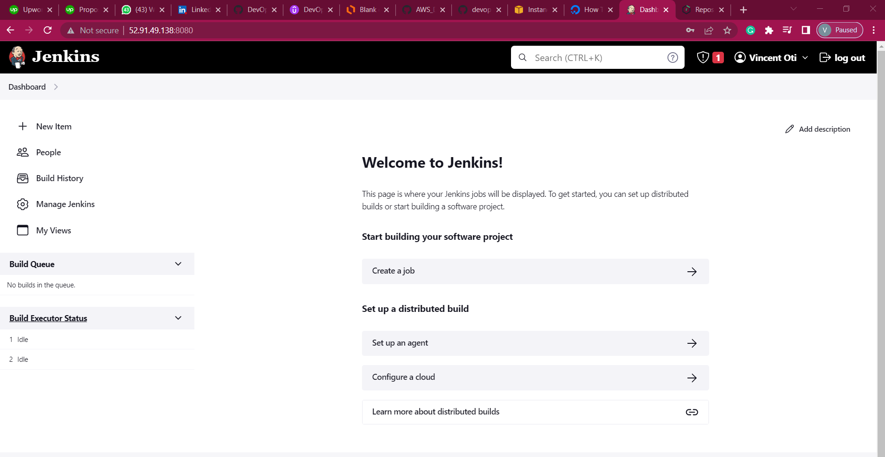
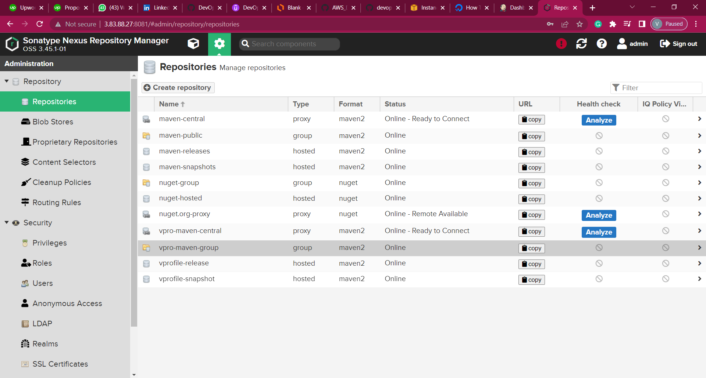
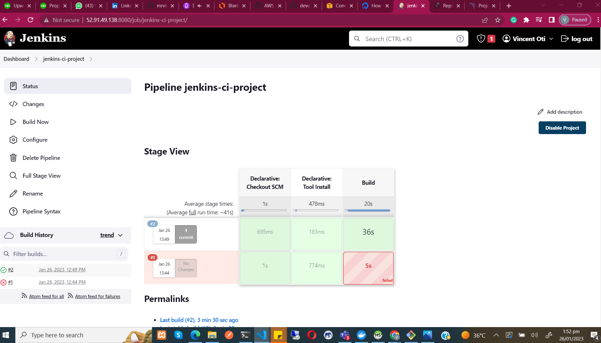

<a name="readme-top"></a>

<!-- [![Contributors][contributors-shield]][contributors-url]
[![Forks][forks-shield]][forks-url]
[![Stargazers][stars-shield]][stars-url]
[![Issues][issues-shield]][issues-url]
[![MIT License][license-shield]][license-url]
[![LinkedIn][linkedin-shield]][linkedin-url] -->

<!-- PROJECT LOGO -->
<br />
<div align="center">
  <a href="">
    
  </a>

  <h3 align="center">DevOps Project 5</h3>

  <p align="center">
    Continous Integration Using Jenkins, Nexus, Sonarqube, and Slack.
  </p>
</div>

### Objective

- Fault Isolation
- Short MTTR
- Fast Turn Around On Feature Changes
- Less Disruptive

<p align="left">
  
</p>

### Built With

- Jenkins (Continous Integration Server)
- Git - (Version Control System)
- Maven (Build tool for java applications)
- Checkstyle (Code analysis)
- Slack (For notification)
- Nexux (Artifact/Software Repository)
- Sonarqube (Code analysis server)
- EC2 (Compute Resources)

<!-- GETTING STARTED -->

## Getting Started

### Prerequisites

<ul style="text-decoration: none;">
  <li>
    <p> AWS Account </p>
  </li>
    <li>
    <p> Github Account </p>
  </li>
    <li>
    <p> Sonarqube Account </p>
  </li>
</ul>

#### 🧾 Steps

#### 0 - Login to your AWS account

#### 1 - Create key pair

Create key pair that will be used with elastic beanstalk.
From the EC2 dashboard on the left menu click `Key Pairs` then `Create key pair`

```
Name: vprofile-ci-key
```

**Note: Download the Key Pair to your local machine**

#### 2 - Create security group for Jenkins, Nexus, and Sonarqube

- Create a security group for jenkins that accepts all traffic for ipv4 and 6 on port 8080 and port 22

```
Name:  `jenkins-sg`
Allow: SSH from My IP
Allow: 8080 from anywhere IPv4 and IPv6 
```

- Create a security group for nexus with below details

```
Name:  `nexus-sg`
Allow: SSH from My IP
Allow: 8081 from My IP and jenkins-sg  

```

- Create a security group for sonarqube with below details

```
Name: `sonar-sg`
Allow: SSH from My IP
Allow: 80 from My IP and jenkins-sg
```

** Add an entry to the jenkins-sg inbound rule to allow access on port 8080 from sonar-sg (Sonar can send report back to jenkins) **

#### 3 - Create EC2 Instances for Jenkins, Nexus, and SonarQube

#### Jenkins Server
- Create jenkins-server with below details

```
Name: jenkins-server
AMI: Ubuntu 20.04
SecGrp: jenkins-SG
InstanceType: t2.small
KeyPair: vprofile-ci-key
Additional Details: userdata below
```

- Jenkins userdata

```
#!/bin/bash
sudo apt update
sudo apt install openjdk-11-jdk -y
sudo apt install maven -y
curl -fsSL https://pkg.jenkins.io/debian-stable/jenkins.io.key | sudo tee \
  /usr/share/keyrings/jenkins-keyring.asc > /dev/null
echo deb [signed-by=/usr/share/keyrings/jenkins-keyring.asc] \
  https://pkg.jenkins.io/debian-stable binary/ | sudo tee \
  /etc/apt/sources.list.d/jenkins.list > /dev/null
sudo apt-get update
sudo apt-get install jenkins -y
###
```
#### Nexus Server
- Create nexus server with details below

```
Name: nexus-server
AMI: Amazon Linux-2
InstanceType: t2.medium
SecGrp: nexus-SG
KeyPair: vprofile-ci-key
Additional Details: userdata below
```

- Nexus userdata

```
#!/bin/bash
yum install java-1.8.0-openjdk.x86_64 wget -y   
mkdir -p /opt/nexus/   
mkdir -p /tmp/nexus/                           
cd /tmp/nexus/
NEXUSURL="https://download.sonatype.com/nexus/3/latest-unix.tar.gz"
wget $NEXUSURL -O nexus.tar.gz
EXTOUT=`tar xzvf nexus.tar.gz`
NEXUSDIR=`echo $EXTOUT | cut -d '/' -f1`
rm -rf /tmp/nexus/nexus.tar.gz
rsync -avzh /tmp/nexus/ /opt/nexus/
useradd nexus
chown -R nexus.nexus /opt/nexus 
cat <<EOT>> /etc/systemd/system/nexus.service
[Unit]                                                                          
Description=nexus service                                                       
After=network.target                                                            
                                                                  
[Service]                                                                       
Type=forking                                                                    
LimitNOFILE=65536                                                               
ExecStart=/opt/nexus/$NEXUSDIR/bin/nexus start                                  
ExecStop=/opt/nexus/$NEXUSDIR/bin/nexus stop                                    
User=nexus                                                                      
Restart=on-abort                                                                
                                                                  
[Install]                                                                       
WantedBy=multi-user.target                                                      

EOT

echo 'run_as_user="nexus"' > /opt/nexus/$NEXUSDIR/bin/nexus.rc
systemctl daemon-reload
systemctl start nexus
systemctl enable nexus
```

#### SonarQube Server

- Create sonarqube-server with below details

```
Name: sonar-server
AMI: Ubuntu 18.04
InstanceType: t2.medium
SecGrp: sonar-SG
KeyPair: vprofile-ci-key
Additional Details: userdata below
```

- Sonarqube userdata

```
#!/bin/bash
cp /etc/sysctl.conf /root/sysctl.conf_backup
cat <<EOT> /etc/sysctl.conf
vm.max_map_count=262144
fs.file-max=65536
ulimit -n 65536
ulimit -u 4096
EOT
cp /etc/security/limits.conf /root/sec_limit.conf_backup
cat <<EOT> /etc/security/limits.conf
sonarqube   -   nofile   65536
sonarqube   -   nproc    409
EOT

sudo apt-get update -y
sudo apt-get install openjdk-11-jdk -y
sudo update-alternatives --config java

java -version

sudo apt update
wget -q https://www.postgresql.org/media/keys/ACCC4CF8.asc -O - | sudo apt-key add -

sudo sh -c 'echo "deb http://apt.postgresql.org/pub/repos/apt/ `lsb_release -cs`-pgdg main" >> /etc/apt/sources.list.d/pgdg.list'
sudo apt install postgresql postgresql-contrib -y
#sudo -u postgres psql -c "SELECT version();"
sudo systemctl enable postgresql.service
sudo systemctl start  postgresql.service
sudo echo "postgres:admin123" | chpasswd
runuser -l postgres -c "createuser sonar"
sudo -i -u postgres psql -c "ALTER USER sonar WITH ENCRYPTED PASSWORD 'admin123';"
sudo -i -u postgres psql -c "CREATE DATABASE sonarqube OWNER sonar;"
sudo -i -u postgres psql -c "GRANT ALL PRIVILEGES ON DATABASE sonarqube to sonar;"
systemctl restart  postgresql
#systemctl status -l   postgresql
netstat -tulpena | grep postgres
sudo mkdir -p /sonarqube/
cd /sonarqube/
sudo curl -O https://binaries.sonarsource.com/Distribution/sonarqube/sonarqube-8.3.0.34182.zip
sudo apt-get install zip -y
sudo unzip -o sonarqube-8.3.0.34182.zip -d /opt/
sudo mv /opt/sonarqube-8.3.0.34182/ /opt/sonarqube
sudo groupadd sonar
sudo useradd -c "SonarQube - User" -d /opt/sonarqube/ -g sonar sonar
sudo chown sonar:sonar /opt/sonarqube/ -R
cp /opt/sonarqube/conf/sonar.properties /root/sonar.properties_backup
cat <<EOT> /opt/sonarqube/conf/sonar.properties
sonar.jdbc.username=sonar
sonar.jdbc.password=admin123
sonar.jdbc.url=jdbc:postgresql://localhost/sonarqube
sonar.web.host=0.0.0.0
sonar.web.port=9000
sonar.web.javaAdditionalOpts=-server
sonar.search.javaOpts=-Xmx512m -Xms512m -XX:+HeapDumpOnOutOfMemoryError
sonar.log.level=INFO
sonar.path.logs=logs
EOT

cat <<EOT> /etc/systemd/system/sonarqube.service
[Unit]
Description=SonarQube service
After=syslog.target network.target

[Service]
Type=forking

ExecStart=/opt/sonarqube/bin/linux-x86-64/sonar.sh start
ExecStop=/opt/sonarqube/bin/linux-x86-64/sonar.sh stop

User=sonar
Group=sonar
Restart=always

LimitNOFILE=65536
LimitNPROC=4096


[Install]
WantedBy=multi-user.target
EOT

systemctl daemon-reload
systemctl enable sonarqube.service
#systemctl start sonarqube.service
#systemctl status -l sonarqube.service
apt-get install nginx -y
rm -rf /etc/nginx/sites-enabled/default
rm -rf /etc/nginx/sites-available/default
cat <<EOT> /etc/nginx/sites-available/sonarqube
server{
    listen      80;
    server_name sonarqube.groophy.in;

    access_log  /var/log/nginx/sonar.access.log;
    error_log   /var/log/nginx/sonar.error.log;

    proxy_buffers 16 64k;
    proxy_buffer_size 128k;

    location / {
        proxy_pass  http://127.0.0.1:9000;
        proxy_next_upstream error timeout invalid_header http_500 http_502 http_503 http_504;
        proxy_redirect off;
              
        proxy_set_header    Host            \$host;
        proxy_set_header    X-Real-IP       \$remote_addr;
        proxy_set_header    X-Forwarded-For \$proxy_add_x_forwarded_for;
        proxy_set_header    X-Forwarded-Proto http;
    }
}
EOT
ln -s /etc/nginx/sites-available/sonarqube /etc/nginx/sites-enabled/sonarqube
systemctl enable nginx.service
#systemctl restart nginx.service
sudo ufw allow 80,9000,9001/tcp

echo "System reboot in 30 sec"
sleep 30
reboot
```

#### 4 - Post Installation

#### Jenkins Server

- Connect to the jenkins machine, check jenkins status, and get initial password

```
sudo -i
systemctl status jenkins
cat /var/lib/jenkins/secrets/initialAdminPassword 
```

- Go to browser, http://<public_ip_of_jenkins_server>:8080, enter initialAdminPasswrd. Install the suggested plugins, and then create an admin user.

<div align="center">
  <a href="">
    
  </a>
</div>

- Install below plugins for jenkins

```
Maven Integration
Github Integration
Nexus Artifact Uploader
SonarQube Scanner
Slack Notification
Build Timestamp
```

#### Nexus Server

- Connect to nexus server using SSH

```
sudo -i
systemctl status nexus
```

- Go to browser, http://<public_ip_of_nexus_server>:8081 ,click sign-in. Initial password will be located at /opt/nexus/sonatype-work/nexus3/admin.password

```
cat /opt/nexus/sonatype-work/nexus3/admin.password
```

```
Username: admin
Password: `from previous step`
```

- Create a repository to store our release artifacts

```
maven2 hosted
Name: vprofile-release
Version policy: Release
```

- Next we will create a maven2 proxy repository. Maven will store the dependecies in this repository, whenever we need any dependency for our project it will check this proxy repo in Nexus first and download it for project. Proxy repo will download the dependecies from maven2 central repo at first.

```
maven2 proxy
Name: vpro-maven-central
remote storage: https://repo1.maven.org/maven2/
```

- This repo will be used to store our snapshot artifacts. That means any artifact with -SNAPSHOT extension will be stored in this repository.

```
maven2 hosted
Name: vprofile-snapshot
Version policy: Snapshot
```

- Create a maven2 group type repo. We will use this repo to group all maven repositories.

```
maven2 group
Name: vpro-maven-group
Member repositories: 
 - vpro-maven-central
 - vprofile-release
 - vprofile-snapshot
```

<div align="center">
  <a href="">
    
  </a>
</div>

#### SonarQube Server

- Go to browser, http://<public_ip_of_sonar_server>.
- Login with username admin and password admin.
- Change the password

### 5 Create a repository in Github

- Create a private repository in Github
- Setup ssh key on github
- Clone the repository

```
git clone -b ci-jenkins https://github.com/devopshydclub/vprofile-project.git .

```

### 6 Build Job With Nexus Repository
- Our first job will be Build the Artifact from Source Code using Maven. We need JDK8 and Maven to be installed in jenkins to complete the job succesfully.

- Since our application is using JDK8, we need to install Java8 in jenkins. `Manage Jenkins` -> `Global Tool Configuration` We will install JDK8 manually, and specify its PATH in here.

```
Under JDK -> Add JDK
Name: OracleJDK8
untick Install Automatically
JAVA_HOME: < we will get after next step >
```

- Currently our jenkins has JDK-11 install, we can SSH into our jenkins server and install JDK-8. Then get the PATH to JDK-8 to replace in above step. So after installation we will see our JAVA_HOME for JDK-8 is /usr/lib/jvm/java-8-openjdk-amd64

```
sudo apt update -y
sudo apt install openjdk-8-jdk -y
sudo -i
ls /usr/lib/jvm
### we should get both jdk-11 and jdk-8 in this path ###
java-1.11.0-openjdk-amd64  java-11-openjdk-amd64  openjdk-11
java-1.8.0-openjdk-amd64   java-8-openjdk-amd64
```

- Setup maven

```
Name: MAVEN3
version : keep same
```
- Next we need to add Nexus login credentials to Jenkins. Go to `Manage Jenkins` -> `Manage Credentials` -> `Global` -> `Add Credentials`

```
username: admin
password: <pwd_setup_for_nexus>
ID: nexuslogin
description: nexuslogin
```

```
We will create Jenkinsfile for Build pipeline as below. The variables mentioned in pom.xml repository part and settings.xml will be declared in Jenkinsfile with their values to be used during execution. Update Pipeline file and push to GitHub.
```

```
pipeline {
    agent any
    tools {
        maven "MAVEN3"
        jdk "OracleJDK8"
    }

    environment {
        SNAP_REPO = 'vprofile-snapshot'
        NEXUS_USER = 'admin'
        NEXUS_PASS = 'admin'
        RELEASE_REPO = 'vprofile-release'
        CENTRAL_REPO = 'vpro-maven-central'
        NEXUSIP = '3.83.88.27'
        NEXUSPORT = '8081'
        NEXUS_GRP_REPO = 'vpro-maven-group'
        NEXUS_LOGIN = 'nexuslogin'
    }

    stages {
        stage('Build') {
            steps {
                sh 'mvn -s settings.xml -DskipTests install'
            }
        }
    }
}

```

- We will create a New Job in Jenkins with below properties:

```
Pipeline from SCM 
Git
URL: <url_from_project> I will use SSH link
Crdentials: we will create github login credentials
#### add Jenkins credentials for github ####
Kind: SSH Username with private key
ID: githublogin
Description: githublogin
Username: git
Private key file: paste your private key here
#####
Branch: */ci-jenkins
path: Jenkinsfile
```

- Error is not gone, we need to login jenkins server via SSH and complete host-key checking step. After below command, our host-key will be stored in .ssh/known_hosts file.Then error will be gone.

```
sudo -i
sudo su - jenkins
git ls-remote -h -- git@github.com:mrvincentoti/jenkins-ci-project.git HEAD
```

- Successful build
<div align="center">
  <a href="">
    
  </a>
</div>