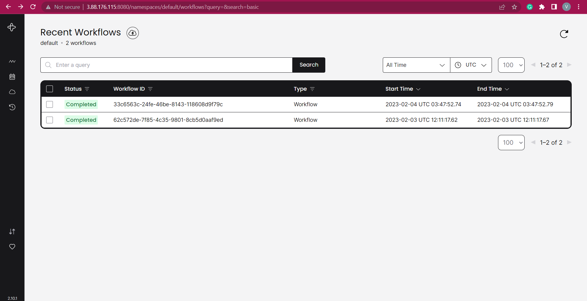
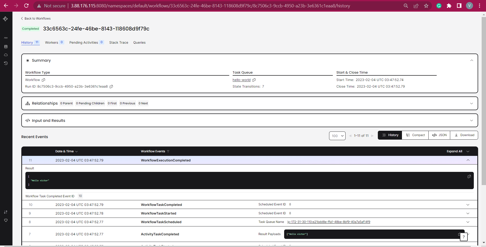
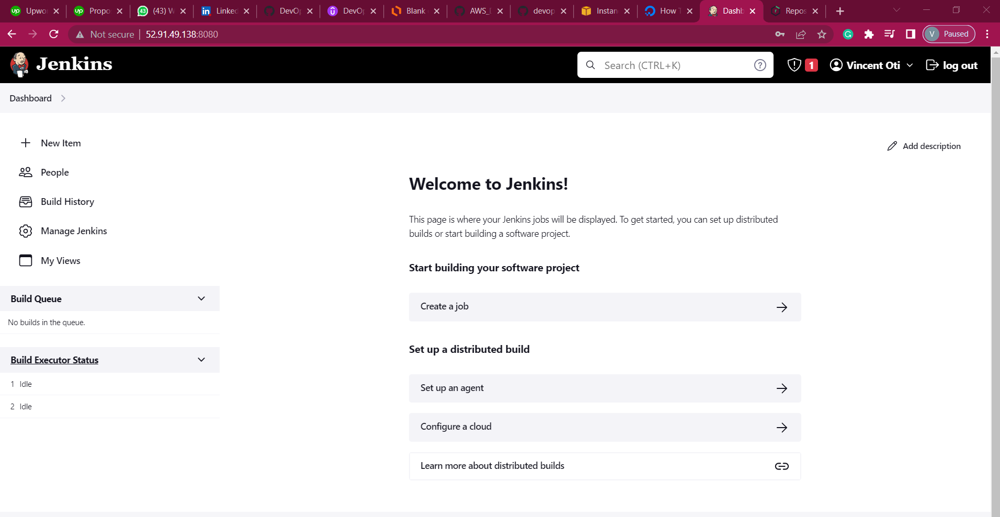

<br />
<div align="center">

  <h3 align="center">Deploy Temporal Server, and GO App to AWS (LiftAndShift)</h3>

</div>

### Built With

- Jenkins (Continous Integration Server)
- Git - (Version Control System)
- Docker
- Docker compose
- GO
- EC2 (Compute Resources)

<!-- GETTING STARTED -->

## Getting Started

### Prerequisites

<ul style="text-decoration: none;">
  <li>
    <p> AWS Account </p>
  </li>
    <li>
    <p> Github Account </p>
  </li>
</ul>

#### 🧾 Steps

#### 0 - Login to your AWS account

#### 1 - Create key pair

Create key pair that will be used to ssh to EC2 instance.
From the EC2 dashboard on the left menu click `Key Pairs` then `Create key pair`

```
Name: wafi-key
```

**Note: Download the Key Pair to your local machine**

#### 2 - Create security group for Temporal Server

- Create a security group for temporal that accepts http traffic for ipv4 and 6 on port 8080 and SSH on port 22

```
Name:  `wafi-sg`
Allow: SSH from My IP
Allow: 8080 from anywhere IPv4 and IPv6 
```

#### 3 - Create EC2 Instances for Temporal

- Create temporal-server with below details

```
Name: temporal-server
AMI: Ubuntu 20.04
SecGrp: temporal-sg
InstanceType: t2.medium
KeyPair: wafi-key
Additional Details: userdata below
```


#### 4 - Post Installation

#### Install dependencies

- Connect to the temporal machine, install docker, docker-compose, and go

```
ssh -i "wafi-key.pem" ubuntu@your-public-ip
```

- Install docker and check status

```
sudo apt update
sudo apt install apt-transport-https ca-certificates curl software-properties-common
curl -fsSL https://download.docker.com/linux/ubuntu/gpg | sudo apt-key add -
sudo add-apt-repository "deb [arch=amd64] https://download.docker.com/linux/ubuntu focal stable"
sudo apt install docker-ce
sudo systemctl status docker
```

- Executing the Docker Command Without Sudo

```
sudo usermod -aG docker ${USER}
```

- Install docker compose and check status

```
sudo curl -L "https://github.com/docker/compose/releases/download/1.29.2/docker-compose-$(uname -s)-$(uname -m)" -o /usr/local/bin/docker-compose
sudo chmod +x /usr/local/bin/docker-compose
docker-compose --version
```

- Install Go
```
cd ~
curl -OL https://golang.org/dl/go1.19.linux-amd64.tar.gz
sudo tar -C /usr/local -xvf go1.19.linux-amd64.tar.gz
go version
```

#### Spin up temporal cluster from a docker compose file
- clone temporalio docker compose repo

```
git clone https://github.com/temporalio/docker-compose.git
cd docker-compose
docker-compose up -d
```

- Test the setup, go to browser and enter

```
http://3.88.176.115:8080
```

#### 5 - Package app as a docker image

- A docker file is created in the hello-workflow directory

- Create a docker image
```
cd hello-workflow
docker build -t hello-workflow-image
```

- run the image on a docker container and put the  container on thesame network as the temporal server
```
docker run --network=temporal-network hello-workflow-image
```

- Navigate to the temporal server ip on the browser to see the workflow in action.

<a href="">
  
</a>
<a href="">
  
</a>

### Outstanding

#### 5 - Write a CICD for the app.

- CICD Server already setup

<a href="">
  
</a>

- Next to write pipeline scripts

#### 6 - Deploy Application on Kubernetes

#### 7 - Possible application improvement

- Add unit tests for the worker and starter
- Implement logging and monitoring for the app
- Implement scaling strategies for the worker and starter
- Consider using managed services (e.g. AWS Fargate) for deploying the app to simplify operations.